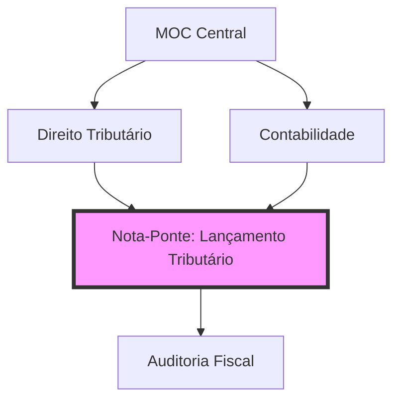

# 🏛️ Projeto Fisco: Constituição Naveável
> **Status:** 🧠 Em Processamento de Conhecimento | **Ambiente:** 🐧 Linux (Fedora/Hyprland) | **Engine:** ⚡ LazyVim + Obsidian

---

## 🗺️ Mapa de Conteúdo (Navegação Rápida)
*Clique nos links abaixo para saltar direto para os módulos no repositório.*

| ID | Disciplina | Foco Principal | Status |
| :--- | :--- | :--- | :--- |
| 📊 | **[00 - Painel Geral](./fisco/00%20-%20Painel%20Geral%20Fiscal)** | Dashboard & MOC Central | 🟢 Ativo |
| ⚖️ | **[01 - D. Tributário](./fisco/01%20-%20Direito%20Tributário)** | CTN, CF e Jurisprudência | 🟡 Revisão |
| 🏛️ | **[02 - D. Constitucional](./fisco/02%20-%20Direito%20Constitucional)** | Organização do Estado & Tributação | ⚪ Planejado |
| 📋 | **[03 - D. Administrativo](./fisco/03%20-%20Direito%20Administrativo)** | Licitações & Atos | ⚪ Planejado |
| 🔢 | **[04 - Contabilidade](./fisco/04%20-%20Contabilidade%20Geral)** | Geral e Avançada (CPC) | 🟠 Em curso |
| 🔍 | **[06 - Auditoria](./fisco/06%20-%20Auditoria)** | Normas e Testes | ⚪ Planejado |
| 📜 | **[07 - Legislação](./fisco/07%20-%20Legislação%20Tributária)** | ICMS/ISS/IPI | ⚪ Planejado |
| 💻 | **[10 - T.I.](./fisco/10%20-%20Tecnologia%20da%20Informação)** | Banco de Dados & Python | 🟢 Ativo |

---

## 🧠 Arquitetura: Constituição Naveável
A estrutura não é linear, é **neuronal**. Cada nota-ponte cria um link semântico que permite transitar entre o texto da lei e a aplicação contábil/auditoria.

### 🛠️ Diferenciais Produtivos
- **MOCs (Maps of Content):** Notas que aglutinam links para evitar o "buraco negro" de arquivos soltos.
- **Backlinks Semânticos:** Uso extensivo de `[[Link]]` para navegação bidirecional no Obsidian.
- **Atomicidade:** Notas curtas e focadas em um único conceito para facilitar a transclusão.

---

## ⚡ Power User Workflow (LazyVim + CLI)
Como este vault é editado via **Neovim**, aqui estão os gatilhos rápidos para máxima produtividade:

| Comando | Ação | Contexto |
| :--- | :--- | :--- |
| `<leader>ff` | **Find File** | Localização instantânea de qualquer nota |
| `<leader>fg` | **Live Grep** | Busca de termos dentro de todas as leis/notas |
| `gd` | **Go Definition** | Seguir o link da nota sob o cursor |
| `Shift + L/H` | **Cycle Buffers** | Alternar entre notas abertas rapidamente |
| `<leader>gg` | **LazyGit** | Sincronização rápida com este repositório |

---

## 📈 Dashboard de Evolução
- **[A fazer.md](./fisco/A%20fazer.md):** 🚀 Próximos tópicos a serem transformados em conhecimento atômico.
- **[Conquistas.md](./fisco/Conquistas.md):** 🏆 Milestones e provas superadas.

---

  <i>"O conhecimento é a única ferramenta que se afia enquanto é usada."</i> 
  <b>Desenvolvido com 🧠 e 💻 via Gemini CLI.</b>

