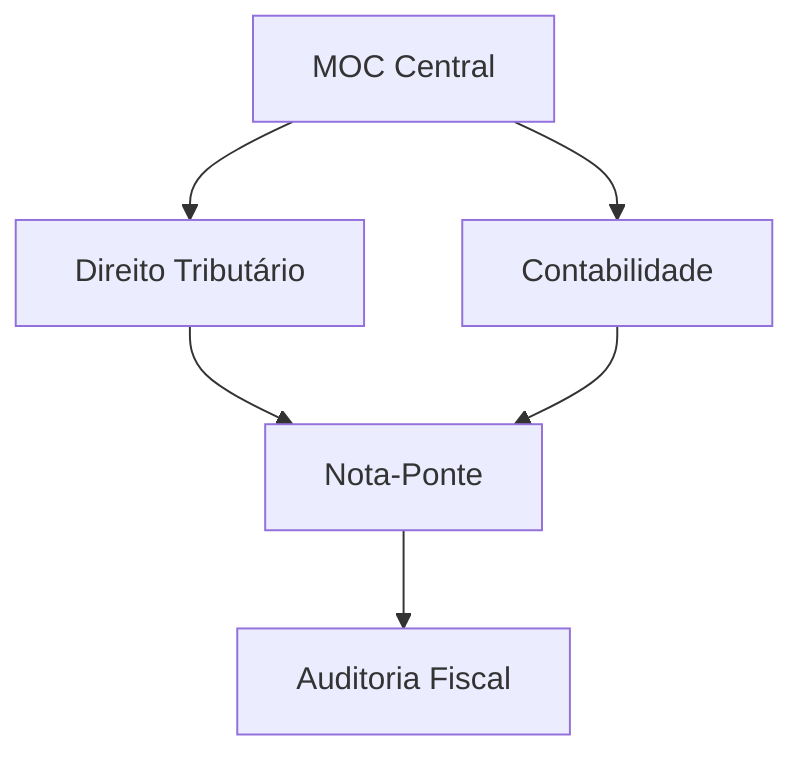

# Projeto Fisco

---

## Conteúdo
- **[Painel Geral](00 - Painel Geral Fiscal/Fiscal.md)**: Dashboard e MOC Central.
- **[D. Tributário](01 - Direito Tributário/01 - Direito Tributário (MOC.md).md)**: CTN, CF e Jurisprudência.
- **[D. Constitucional](02 - Direito Constitucional/02 - Direito Constitucional (MOC.md).md)**: Organização do Estado.
- **[D. Administrativo](03 - Direito Administrativo/03 - Direito Administrativo (MOC.md).md)**: Licitações e Atos.
- **[Contabilidade](04 - Contabilidade Geral/04 - Contabilidade Geral (MOC.md).md)**: Geral e Avançada.
- **[T.I.](10 - Tecnologia da Informação/10 - Tecnologia da Informação (MOC.md).md)**: Banco de Dados e Gestão.

---

## Arquitetura
Sistema de links semânticos entre base legal e aplicação prática (MOCs e Notas-Ponte).

---
[A fazer](fisco/A fazer.md) | [Conquistas](fisco/Conquistas.md)