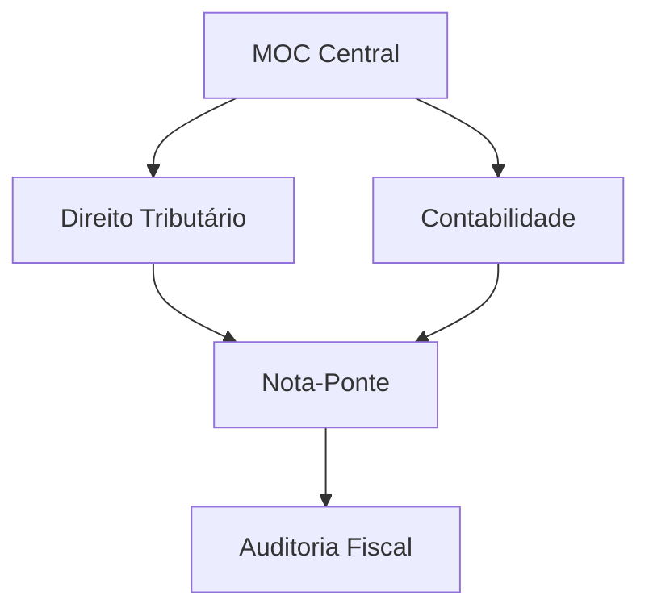

# Projeto Fisco

---

## Conteúdo
- **[[00 - Painel Geral Fiscal/Fiscal.md|Painel Geral]]**: Dashboard e MOC Central.
- **[[01 - Direito Tributário/01 - Direito Tributário (MOC).md|D. Tributário]]**: CTN, CF e Jurisprudência.
- **[[02 - Direito Constitucional/02 - Direito Constitucional (MOC).md|D. Constitucional]]**: Organização do Estado.
- **[[03 - Direito Administrativo/03 - Direito Administrativo (MOC).md|D. Administrativo]]**: Licitações e Atos.
- **[[04 - Contabilidade Geral/04 - Contabilidade Geral (MOC).md|Contabilidade]]**: Geral e Avançada.
- **[[10 - Tecnologia da Informação/10 - Tecnologia da Informação (MOC).md|T.I.]]**: Banco de Dados e Gestão.

---

## Arquitetura
Sistema de links semânticos entre base legal e aplicação prática (MOCs e Notas-Ponte).

---
[[fisco/A fazer.md|A fazer]] | [[fisco/Conquistas.md|Conquistas]]