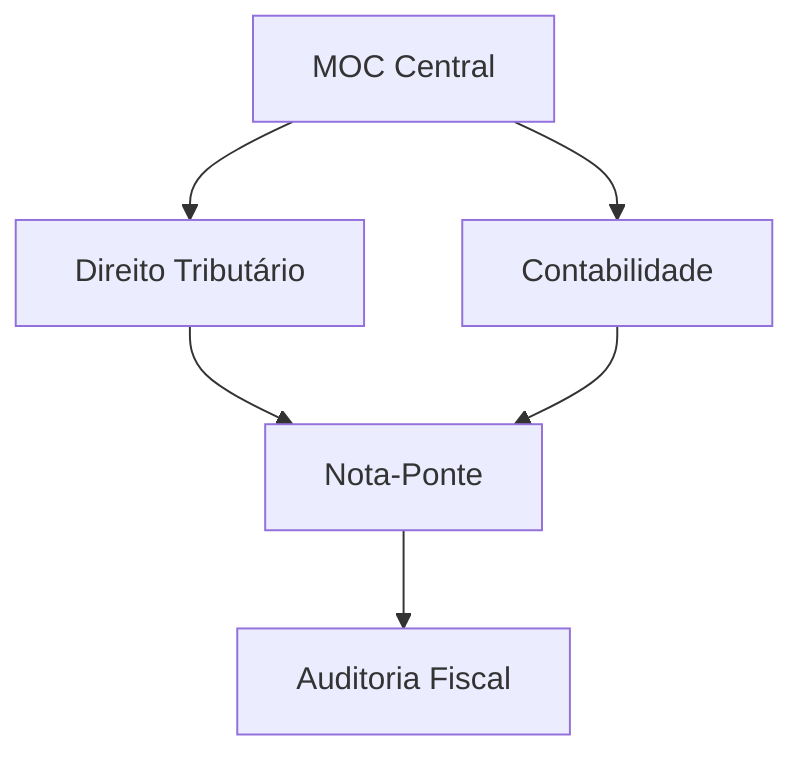

# Projeto Fisco: Constituição Navegável

**Status:** Processamento de Conhecimento | **Ambiente:** Linux (Fedora) | **Engine:** LazyVim + Obsidian

---

## Mapa de Conteúdo

| ID | Disciplina | Foco Principal | Status |
| :-- | :--- | :--- | :--- |
| 00 | **[Painel Geral](./00%20-%20Painel%20Geral%20Fiscal/Fiscal.md)** | Dashboard e MOC Central | Ativo |
| 01 | **[D. Tributário](./01%20-%20Direito%20Tributário/01%20-%20Direito%20Tributário%20(MOC).md)** | CTN, CF e Jurisprudência | Revisão |
| 02 | **[D. Constitucional](./02%20-%20Direito%20Constitucional/02%20-%20Direito%20Constitucional%20(MOC).md)** | Organização do Estado | Planejado |
| 03 | **[D. Administrativo](./03%20-%20Direito%20Administrativo/03%20-%20Direito%20Administrativo%20(MOC).md)** | Licitações e Atos | Planejado |
| 04 | **[Contabilidade](./04%20-%20Contabilidade%20Geral/04%20-%20Contabilidade%20Geral%20(MOC).md)** | Geral e Avançada (CPC) | Em curso |
| 06 | **[Auditoria](./06%20-%20Auditoria/06%20-%20Auditoria%20(MOC).md)** | Normas e Testes | Planejado |
| 07 | **[Legislação](./07%20-%20Legislação%20Tributária/07%20-%20Legislação%20Tributária%20(MOC).md)** | ICMS, ISS, IPI | Planejado |
| 10 | **[T.I.](./10%20-%20Tecnologia%20da%20Informação/10%20-%20Tecnologia%20da%20Informação%20(MOC).md)** | Banco de Dados | Ativo |

---

## Arquitetura
A estrutura utiliza links semânticos entre a base legal e a aplicação prática.

### Princípios
- **MOCs (Maps of Content):** Notas aglutinadoras de temas.
- **Notas-Ponte:** Conexões interdisciplinares.
- **Backlinks:** Navegação bidirecional.
- **Atomicidade:** Notas focais.

---

## Workflow (LazyVim)

| Comando | Ação |
| :--- | :--- |
| `<leader>ff` | Buscar arquivo |
| `<leader>fg` | Buscar conteúdo |
| `gd` | Seguir link |
| `<leader>gg` | LazyGit |

---

## Dashboard de Evolução
- **[A fazer.md](./fisco/A%20fazer.md)**
- **[Conquistas.md](./fisco/Conquistas.md)**

---

  <i>"O conhecimento é a única ferramenta que se afia enquanto é usada."</i>

